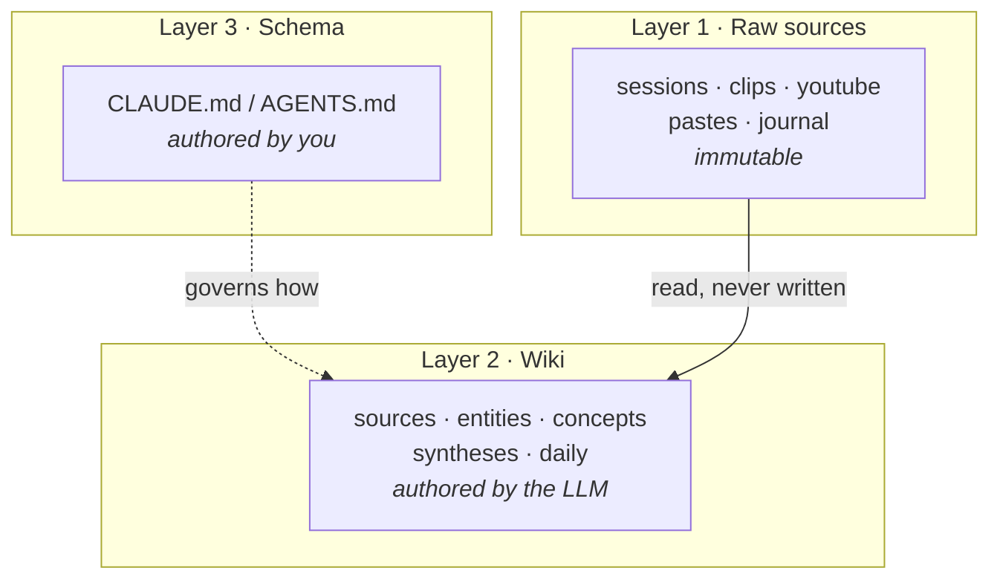
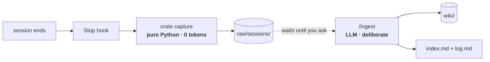
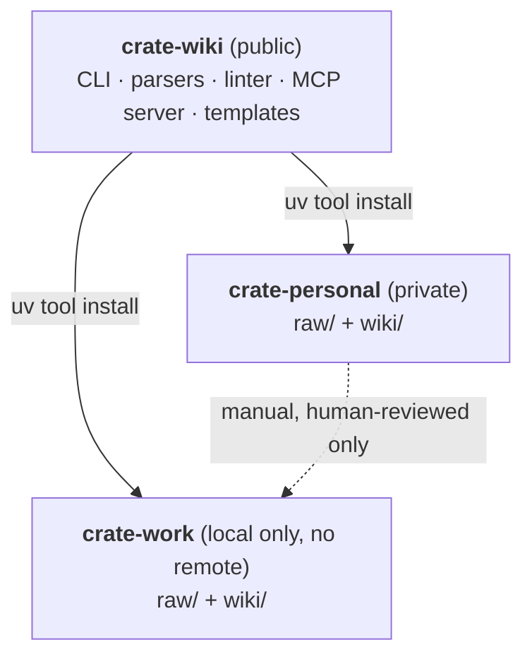

# Architecture

How crate-wiki is put together, and why. For individual decisions and the alternatives rejected, see the [ADRs](adr/).

## The three layers

The structure comes from [Karpathy's LLM Wiki](https://gist.github.com/karpathy/442a6bf555914893e9891c11519de94f). What matters is the write boundary: each layer has exactly one author, and nothing crosses.



**Raw sources** are append-only ground truth. The LLM reads them and never writes them — so a bad synthesis is always recoverable by re-reading the source.

**The wiki** is entirely LLM-maintained. Pages cross-reference each other with wikilinks; `index.md` catalogs them; `log.md` records every operation.

**The schema** is the highest-leverage file in a vault. It's what turns a general assistant into something that follows conventions, updates cross-references, and flags contradictions instead of just answering. It is expected to co-evolve and is never "done".

## Two tiers: free capture, paid synthesis

The constraint that shaped this: a Claude Pro plan has a rolling usage limit. Anything expensive that runs on a schedule you don't control will eventually lock you out at the worst moment.

So the work splits by cost:



**Tier 0 — capture.** Deterministic, free, automatic. Runs on every session whether you think about it or not.

**Tier 1 — synthesis.** Costs tokens, so it only runs when you invoke it.

The split means capture is never the thing you forget, and synthesis never fires without your say-so. See [ADR-0002](adr/0002-free-capture-paid-synthesis.md).

## Engine and vaults



The engine holds no content; the vaults hold no code. One upgrade reaches both vaults, and the code can be public because your data was never in it. See [ADR-0003](adr/0003-engine-vaults-over-fork.md).

Work and personal are isolated primarily by physics — separate machines. The work vault additionally has no git remote ([ADR-0001](adr/0001-local-only-work-vault.md)). Any work→personal transfer is a deliberate human step; automating it would automate the exact leak the isolation exists to prevent.

## Vault layout

The vault root is also an Obsidian vault, so the wiki is browsable and the graph view works for free.

```
CLAUDE.md            # Layer 3 — the schema
AGENTS.md            #   same schema for Codex
index.md             # catalog: every page, link, one-line summary
log.md               # append-only:  ## [2026-07-17] ingest | Title
raw/                 # Layer 1 — immutable
  sessions/          #   claude-code/, codex/   (hook-written)
  clips/             #   Obsidian Clipper target
  youtube/
  pastes/            #   slack / email / teams
  journal/           #   personal scope only — gitignored
  assets/
wiki/                # Layer 2 — LLM-maintained
  sources/           #   one summary page per raw source
  entities/          #   people, projects, repos, systems
  concepts/          #   ideas, patterns, techniques
  syntheses/         #   query answers worth keeping
  daily/             #   YYYY-MM-DD.md
.crate/
  config.toml        #   scope, raw sections, push policy — the vault's contract
  state.json         #   capture cursor — makes re-runs idempotent
  templates/         #   one page skeleton per type, carrying the exact frontmatter
```

`crate init <path> --scope work|personal` builds this. The scope is a *preset*: it seeds `config.toml`, and that file is the truth afterwards. Sections under `raw/` are data there rather than cases in code, each with a `private` flag that drives both the `.gitignore` and a rule in the schema — see [ADR-0006](adr/0006-private-sections-are-context-only.md), because the gitignore is only half of it.

## The session parser

The most interesting component, because its job is **discarding, not converting**.

Claude Code stores sessions as JSONL, one record per line, at `~/.claude/projects/<munged-cwd>/<session-uuid>.jsonl`. Two properties make naive conversion wrong:

- **`parentUuid` makes a session a tree, not a transcript.** Rewinding or editing a prompt branches it. A flat read replays abandoned work as though it happened.
- **`tool_result` bodies dominate the bytes.** A whole file read, a full test log — none of it is what you did, and all of it drowns what you did.

So the parser walks to the active leaf, discards dead branches, and emits a *session card*:

| | |
|---|---|
| **Keep** | Your prompts verbatim (the intent), assistant prose, files touched (from `Edit`/`Write` params), commands run, git branch, timings |
| **Drop** | `tool_result` bodies, `thinking` blocks, dead branches |
| **Collapse** | Sidechains (`isSidechain`) to one line per subagent |

The result is roughly a tenth the size and carries nearly all the signal — which is also what makes Tier 1 affordable.

A `state.json` cursor tracks what's already been captured, so the hook can run on every session and stay idempotent.
