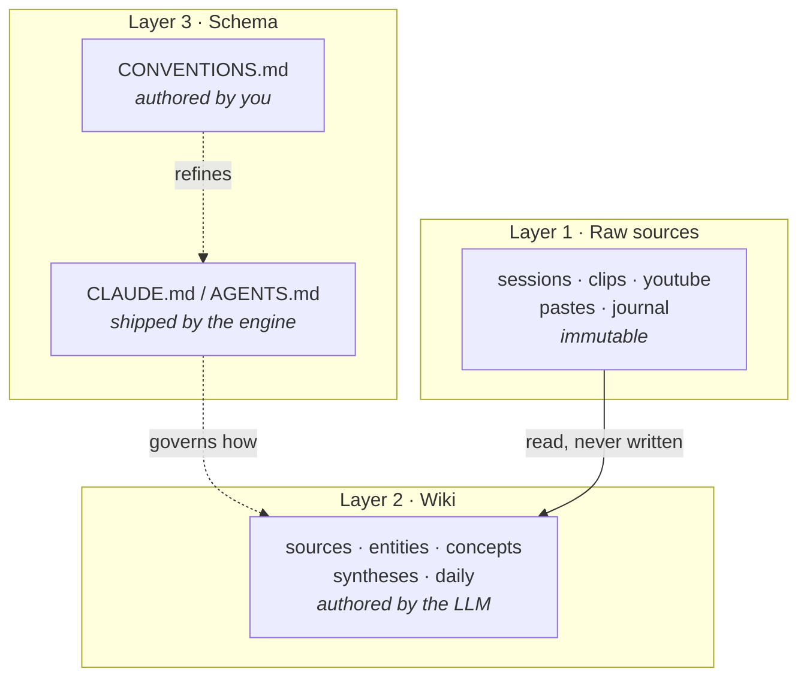
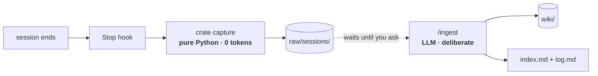
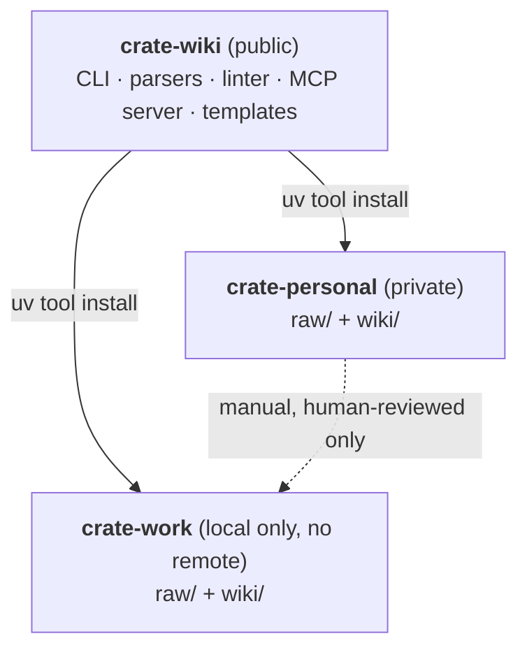
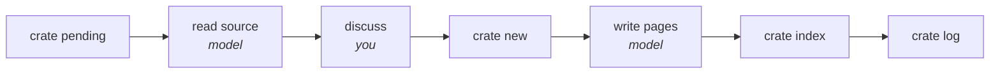

# Architecture

How crate-wiki is put together, and why. For individual decisions and the alternatives rejected, see the [ADRs](adr/).

## The three layers

The structure comes from [Karpathy's LLM Wiki](https://gist.github.com/karpathy/442a6bf555914893e9891c11519de94f). What matters is the write boundary: each layer has exactly one author, and nothing crosses.



**Raw sources** are append-only ground truth. The LLM reads them and never writes them — so a bad synthesis is always recoverable by re-reading the source.

**The wiki** is entirely LLM-maintained. Pages cross-reference each other with wikilinks; `index.md` catalogs them; `log.md` records every operation.

**The schema** is the highest-leverage file in a vault. It's what turns a general assistant into something that follows conventions, updates cross-references, and flags contradictions instead of just answering.

Layer 3 is two files with two owners. `CLAUDE.md` is the engine's prose about how a crate vault works — identical in every vault but for the name rendered into it — so the engine ships it and `crate upgrade` refreshes it. `CONVENTIONS.md` is what *this* vault has decided, and the engine never writes it after creating it. That split is what lets the schema co-evolve without every release handing back a merge; before it, a local rule and a shipped change competed for the same file. See [ADR-0010](adr/0010-conventions-file-and-upgrade-baseline.md).

## Two tiers: free capture, paid synthesis

The constraint that shaped this: a Claude Pro plan has a rolling usage limit. Anything expensive that runs on a schedule you don't control will eventually lock you out at the worst moment.

So the work splits by cost:



**Tier 0 — capture.** Deterministic, free, automatic. Runs on every session whether you think about it or not.

**Tier 1 — synthesis.** Costs tokens, so it only runs when you invoke it.

The split means capture is never the thing you forget, and synthesis never fires without your say-so. See [ADR-0002](adr/0002-free-capture-paid-synthesis.md).

## Engine and vaults



The engine holds no content; the vaults hold no code. One upgrade reaches both vaults, and the code can be public because your data was never in it. See [ADR-0003](adr/0003-engine-vaults-over-fork.md).

Work and personal are isolated primarily by physics — separate machines. The work vault additionally has no git remote ([ADR-0001](adr/0001-local-only-work-vault.md)). Any work→personal transfer is a deliberate human step; automating it would automate the exact leak the isolation exists to prevent.

## Vault layout

The vault root is also an Obsidian vault, so the wiki is browsable and the graph view works for free.

```
CLAUDE.md            # Layer 3 — the schema, shipped and refreshed by the engine
AGENTS.md            #   same schema for Codex
CONVENTIONS.md       #   Layer 3 — what this vault decided; the engine never touches it
index.md             # catalog: every page, link, one-line summary — generated by `crate index`
log.md               # append-only:  ## [2026-07-17] ingest | Title
raw/                 # Layer 1 — immutable
  sessions/          #   claude-code/, codex/   (hook-written)
  clips/             #   Obsidian Clipper target
  youtube/
  pastes/            #   slack / email / teams
  journal/           #   personal scope only — gitignored
  assets/
wiki/                # Layer 2 — LLM-maintained
  sources/           #   one summary page per raw source
  entities/          #   people, projects, repos, systems
  concepts/          #   ideas, patterns, techniques
  syntheses/         #   query answers worth keeping
  daily/             #   YYYY-MM-DD.md
.crate/
  config.toml        #   scope, raw sections, push policy — the vault's contract
  state.json         #   capture cursor — machine-local, gitignored
  baseline.json      #   hashes of what the engine last wrote — committed, travels with the vault
  templates/         #   one page skeleton per type, carrying the exact frontmatter
.claude/
  commands/          #   the operations — /ingest, /ask, /daily, /lint
```

Every file the engine puts in a vault falls in one of three classes, decided when the file is added. **Engine-owned** — `CLAUDE.md`, `AGENTS.md`, `.crate/templates/`, `.claude/commands/` — is installed by `crate init` and refreshed by `crate upgrade`. **Seeded** is `CONVENTIONS.md`: created once when it's missing, never written again. Everything else is **authored** and the engine writes it at most once. Slash commands have to be on disk for Claude Code to find them, which is what makes a vault not quite pure content — see [ADR-0009](adr/0009-engine-owned-vault-files.md).

Refreshing the schema is only safe because `.crate/baseline.json` records a hash of what the engine last wrote to each file. Without it, upgrade can only compare the vault against what the *current* version ships, which reports every vault as edited the moment a template moves. With it, upgrade tells the two apart and leaves a genuinely edited file alone — or an unrecognised one, which is what a vault predating the baseline looks like until `crate upgrade --adopt` claims it. See [ADR-0010](adr/0010-conventions-file-and-upgrade-baseline.md).

`crate init <path> --scope work|personal` builds this. The scope is a *preset*: it seeds `config.toml`, and that file is the truth afterwards. Sections under `raw/` are data there rather than cases in code, each with a `private` flag that drives both the `.gitignore` and a rule in the schema — see [ADR-0006](adr/0006-private-sections-are-context-only.md), because the gitignore is only half of it.

## Inside an operation

`/ingest`, `/ask`, `/daily` and `/lint` are slash commands, not CLI subcommands — their purpose is judgment.
But each is a *sequence*, and the steps alternate. Folding a source into the wiki means working out
what mattered (judgment) and also working out which raw files aren't in the wiki yet (one right
answer), writing prose (judgment) and also appending a fixed-format log line (one right answer).

So the boundary from [ADR-0004](adr/0004-deterministic-cli.md) is applied per step, not per
operation ([ADR-0008](adr/0008-code-and-prompt-inside-an-operation.md)). `/ingest` is a prompt that
calls four deterministic commands at the four points where the answer is fixed:



Two things fall out of that. `index.md` is **derived** — a page's one-line entry lives in its own
`summary:` frontmatter, and `crate index` regenerates the catalog from those, so a page can't be
silently dropped from it. And "already ingested" is derived too: it's the union of `sources:` across
`wiki/sources/` pages, which is why re-running `/ingest` can't duplicate work.

The step in the middle is the one that isn't automatable at all. `/ingest` presents its takeaways and
a page plan and then stops, before writing anything. Without that it's a summarizer.

Every operation since has been built the same way, and the primitives turned out to be
operation-agnostic on purpose: `/ask` reuses all of them and adds no command of its own
([ADR-0011](adr/0011-ask-and-the-promoted-synthesis.md)). `/daily` is the one that earned surface —
`crate day` — because "which session cards belong to yesterday" is a question the existing commands
can't answer: `crate pending` is keyed on ingest state rather than a date, and it *hides* an
ingested card, which a day's account still has to read. The rule an operation is held to is the same
either way ([ADR-0012](adr/0012-daily-reads-raw-and-earns-a-command.md)): a command for a mechanical
step with no home, and nothing for a step the model should be doing.

## The session parser

The most interesting component, because its job is **discarding, not converting**.

It splits along one seam (ADR-0014): a shared core (`cards.py`) owns the *session card* — the model, the Markdown renderer, and the idempotent cursor — and a thin **adapter per source** owns reading that source's on-disk format up to a card. Two sources exist today, `claude.py` and `codex.py`, and they differ in exactly the way that makes the split worth having.

**Claude Code** stores sessions as JSONL, one record per line, at `~/.claude/projects/<munged-cwd>/<session-uuid>.jsonl`. Two properties make naive conversion wrong:

- **`parentUuid` makes a session a tree, not a transcript.** Rewinding or editing a prompt branches it. A flat read replays abandoned work as though it happened.
- **`tool_result` bodies dominate the bytes.** A whole file read, a full test log — none of it is what you did, and all of it drowns what you did.

So the Claude adapter walks to the active leaf, discards dead branches, and emits a card:

| | |
|---|---|
| **Keep** | Your prompts verbatim (the intent), assistant prose, files touched (from `Edit`/`Write` params), commands run, git branch, timings |
| **Drop** | `tool_result` bodies, `thinking` blocks, dead branches |
| **Collapse** | Sidechains (`isSidechain`) to one line per subagent |

**Codex** (`~/.codex/sessions/<Y>/<M>/<D>/rollout-*.jsonl`) is the counter-example that proves the model generalizes: a flat append-only log with no tree and no rewinds, where a command is a `function_call` and a file edit is an `apply_patch` whose path lives inside a patch string. Its adapter is a linear scan rather than a tree walk, keeps and drops the same *kinds* of thing, and emits the same card. The structure differs but the shape recurs — Codex resumes into a *new* file (so a card is keyed by the per-file rollout id, not the shared thread id), and its subagents (the `guardian` auto-approver) are their own files marked `thread_source: subagent`, the equivalent of Claude's sidechains and dropped the same way.

The result is roughly a tenth the size and carries nearly all the signal — which is also what makes Tier 1 affordable.

A `state.json` cursor tracks what's already been captured, keyed per source, so the hook can run on every session and stay idempotent — and a Codex capture never disturbs Claude's cursor.

Codex has no Stop hook to drive this automatically, so it's swept on demand instead: `crate capture codex` / `/fetch-codex` walks `~/.codex/sessions/` and captures every new or changed rollout in one idempotent pass.
